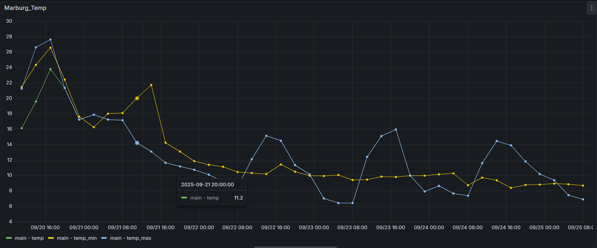
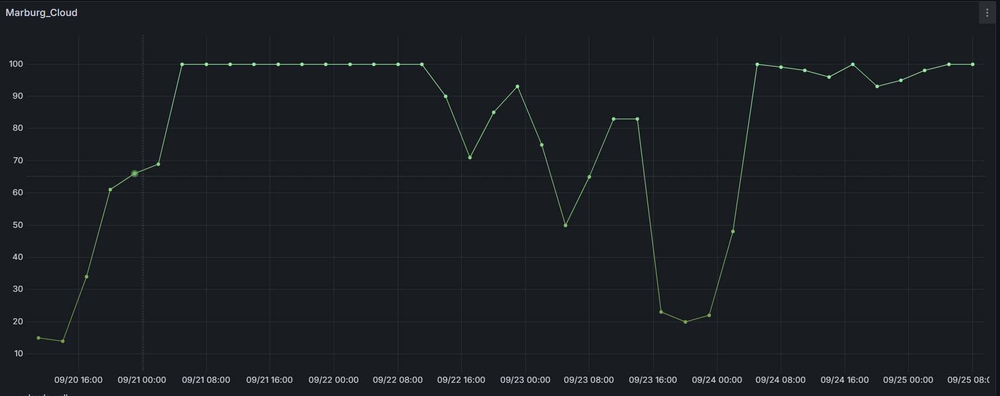

**OpenWeather Grafana Datenquelle**

- Holt OpenWeather REST API-Daten und visualisiert sie als Zeitreihe in Grafana.
- Bietet 5-Tage/3-Stunden-Vorhersagedaten mit Auswahl von Stadt, Metrik (Temperatur, Luftfeuchtigkeit, Druck, Wind, Wolken, Regen) und Einheit (metrisch/imperial/standard).
- Enthält sichere API-Schlüsselverwaltung, Gesundheitsprüfung und eine Docker-basierte Entwicklungsumgebung.

**Funktionen**

- Verwendet den OpenWeather Forecast (5 Tage / 3 Stunden) Endpunkt.
- Abfrageeditor: `city`, `mainParameter` (main/wind/clouds/rain), `subParameter` (z.B. temp, feels_like, pressure, speed, all, 3h), `units`.
- Ausgabe: Einzelner Zeitreihen-Frame mit den Feldern `time` und `value`; als Grafik/Tabelle im Panel verwendbar.
- Gesundheitsprüfung: API-Schlüssel wird validiert; gibt Fehler zurück, wenn er fehlt.
- Kompatibel mit Grafana >= 10.4, lokale Entwicklung mit Docker (Grafana 11.x).

**Voraussetzungen**

- Node.js `>=22`
- Go `>=1.22`
- Docker (optional, für lokale Grafana-Instanz)
- OpenWeather API-Schlüssel (https://openweathermap.org/api)

**Installation (Entwicklung)**

- Abhängigkeiten: `npm install`
- Backend-Build: `mage -v`
- Frontend-Watch: `npm run dev`
- Grafana mit Docker: `npm run server` (Grafana unter `http://localhost:3001`)
- Grafana Datenquelle einrichten: Einstellungen > Datenquellen > Dieses Plugin > OpenWeather API-Schlüssel im Feld `API Key` eingeben und speichern.

**Verwendung**

- Neues Panel erstellen und dieses Plugin als Datenquelle auswählen.
- Abfragefelder:
  - `City`: Stadtname (z.B. `Istanbul,tr` oder `London,uk`).
  - `Main Parameter`: `main | wind | clouds | rain`.
  - `Parameters` (Unterparameter):
    - `main`: `temp`, `feels_like`, `temp_min`, `temp_max`, `pressure`, `sea_level`, `grnd_level`, `humidity`.
    - `wind`: `speed`, `deg`, `gust`.
    - `clouds`: `all`.
    - `rain`: `3h` (Niederschlagsmenge der letzten 3 Stunden).
  - `Units`: `metric | imperial | standard`.
- Werte im Panel als „Time series“ oder „Table“ visualisieren.

**Provisioning (Optional)**

- Beispiel für Entwicklung: `provisioning/datasources/datasources.yml`:

```
apiVersion: 1

datasources:
  - name: 'openweather'
    type: 'openweather-datasource'
    access: proxy
    isDefault: false
    jsonData:
      path: '/resources'
    secureJsonData:
      apiKey: '<openweather-api-key>'
```

Hinweis: Die Plugin-ID und Docker-Konfiguration verwenden im Projekt `openweather-datasource`.

**Architektur**

- Frontend (TypeScript/React): `src/components/QueryEditor.tsx` und `ConfigEditor.tsx` bieten Abfrage- und Einstellungs-UI.
- Backend (Go): `pkg/plugin/datasource.go` verarbeitet OpenWeather API-Aufrufe und gibt ein Grafana DataFrame zurück.
- Sichere Einstellungen: `secureJsonData.apiKey` wird nur an das Backend gesendet.

**Befehle**

- Entwicklungs-Build: `npm run dev`
- Produktions-Build: `npm run build`
- Backend-Build: `mage -v`
- Lint: `npm run lint` oder `npm run lint:fix`
- E2E-Test: `npm run e2e`
- Lokales Grafana (Docker): `npm run server`

**Fehlerbehebung**

- 401/403: API-Schlüssel fehlt/ungültig. Überprüfen Sie den Wert im Feld `API Key` in den Datenquellen-Einstellungen.
- 404: Stadtname ungültig oder nicht gefunden. Überprüfen Sie das Feld `City` (z.B. `City,countryCode`).
- 429: OpenWeather-Kontingent überschritten. Reduzieren Sie die Anfragen oder erhöhen Sie Ihr Paket.
- Leeres Ergebnis: Das Vorhersagezeitfenster beträgt 5 Tage/3 Stunden; probieren Sie andere Parameter/Stadt.

**Deployment und Signierung**

- Grafana-Plugins müssen für die Produktion signiert werden: `npx @grafana/sign-plugin`.
- Für den Signierungs-/Marketplace-Prozess: https://grafana.com/developers/plugin-tools/publish-a-plugin/sign-a-plugin

**Lizenz**

- Apache-2.0 (siehe `LICENSE`).

## Beispiel

## Temperatur



## Wind


## Wolken


