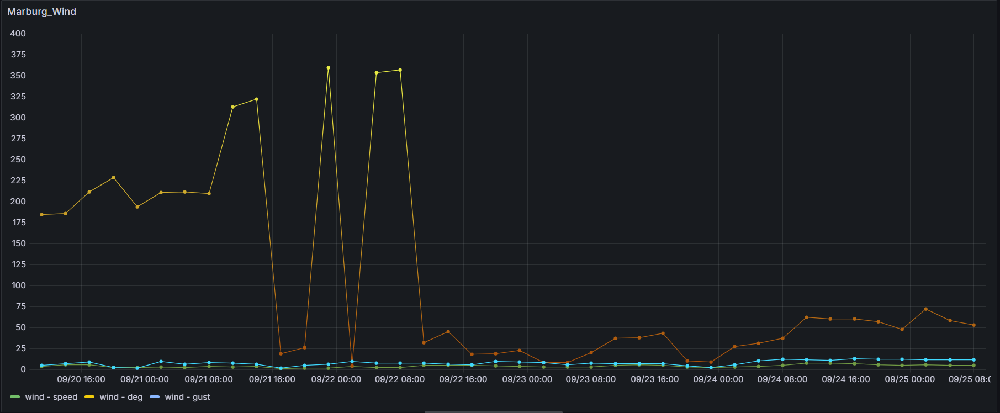
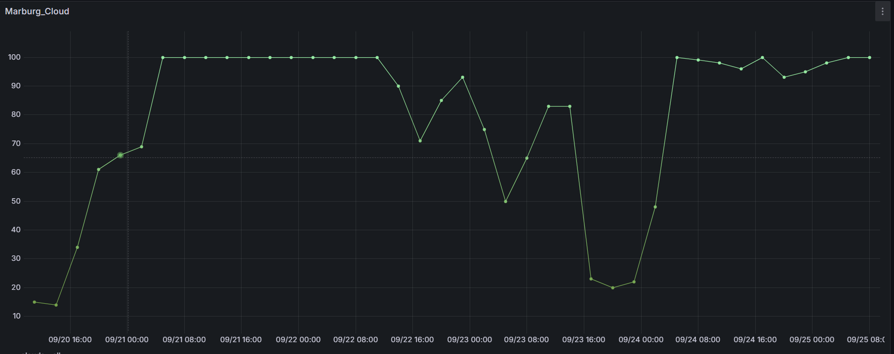

datasources:

**OpenWeather Grafana Data Source**

- Fetches OpenWeather REST API data and visualizes it as a time series in Grafana.
- Provides 5-day/3-hour forecast data with city, metric (temperature, humidity, pressure, wind, clouds, rain), and unit (metric/imperial/standard) selection.
- Includes secure API key management, health checks, and Docker-based development environment.

**Features**

- Uses the OpenWeather Forecast (5 day / 3 hour) endpoint.
- Query editor: `city`, `mainParameter` (main/wind/clouds/rain), `subParameter` (e.g., temp, feels_like, pressure, speed, all, 3h), `units`.
- Output: Single time series Frame with `time` and `value` fields; usable as graph/table in panel.
- Health check: API key is validated; returns error if missing.
- Compatible with Grafana >= 10.4, local development with Docker (Grafana 11.x).

**Requirements**

- Node.js `>=22`
- Go `>=1.22`
- Docker (optional, for local Grafana)
- OpenWeather API key (https://openweathermap.org/api)

**Setup (Development)**

- Dependencies: `npm install`
- Backend build: `mage -v`
- Frontend watch: `npm run dev`
- Grafana with Docker: `npm run server` (Grafana at `http://localhost:3001`)
- Grafana data source setup: Settings > Data sources > This plugin > Enter your OpenWeather API key in the `API Key` field and save.

**Usage**

- Create a new panel and select this plugin as the data source.
- Query fields:
  - `City`: City name (e.g., `Istanbul,tr` or `London,uk`).
  - `Main Parameter`: `main | wind | clouds | rain`.
  - `Parameters` (sub-parameter):
    - `main`: `temp`, `feels_like`, `temp_min`, `temp_max`, `pressure`, `sea_level`, `grnd_level`, `humidity`.
    - `wind`: `speed`, `deg`, `gust`.
    - `clouds`: `all`.
    - `rain`: `3h` (last 3 hours rainfall volume).
  - `Units`: `metric | imperial | standard`.
- Visualize values using “Time series” or “Table” in the panel.

**Provisioning (Optional)**

- Example for development: `provisioning/datasources/datasources.yml`:

```
apiVersion: 1


  - name: 'openweather'
    type: 'openweather-datasource'
    access: proxy
    isDefault: false
    jsonData:
      path: '/resources'
    secureJsonData:
      apiKey: '<openweather-api-key>'
```

Note: The plugin ID and Docker configuration use `openweather-datasource` in the project.

**Architecture**

- Frontend (TypeScript/React): `src/components/QueryEditor.tsx` and `ConfigEditor.tsx` provide query and settings UI.
- Backend (Go): `pkg/plugin/datasource.go` handles OpenWeather API calls and returns Grafana DataFrame.
- Secure settings: `secureJsonData.apiKey` is sent only to the backend.

**Commands**

- Development build: `npm run dev`
- Production build: `npm run build`
- Backend build: `mage -v`
- Lint: `npm run lint` or `npm run lint:fix`
- E2E test: `npm run e2e`
- Local Grafana (Docker): `npm run server`

**Troubleshooting**

- 401/403: API key missing/invalid. Check the `API Key` value in data source settings.
- 404: Invalid or not found city name. Check the `City` field (e.g., `City,countryCode`).
- 429: OpenWeather quota exceeded. Reduce requests or upgrade your plan.
- Empty result: Forecast data window is 5 days/3 hours; try different parameter/city.

**Deployment and Signing**

- Grafana plugins must be signed for production: `npx @grafana/sign-plugin`.
- For signing/marketplace process: https://grafana.com/developers/plugin-tools/publish-a-plugin/sign-a-plugin

**License**

- Apache-2.0 (see `LICENSE`).

## Example

## Temperature


## Wind



## Cloud


